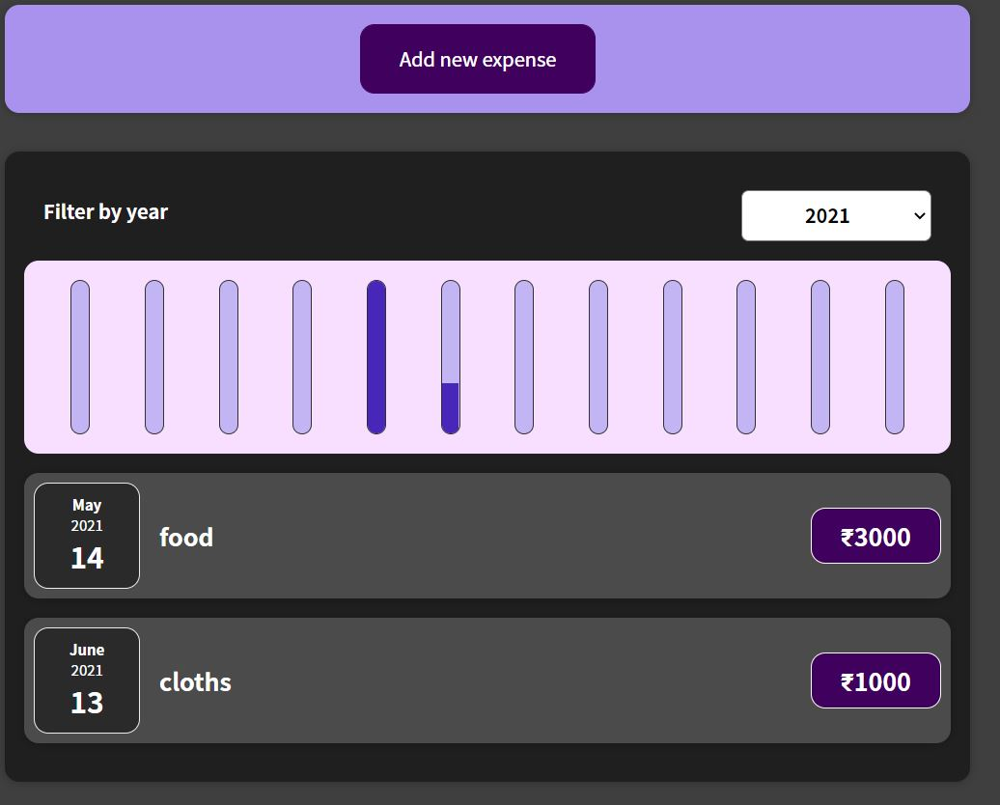

# Expense-manager

This project was generated with [React CLI](https://github.com/facebook/create-react-app) version 17.0.2

## Development server

Run `npm start` for a dev server. Navigate to `http://localhost:3000/`. The app will automatically reload if you change any of the source files.

## React Help
For help getting started with React, view our
[online documentation](https://reactjs.org/docs/getting-started.html), which offers tutorials, samples and guidance.

## screenshots

1st screenshot

2nd screenshot

